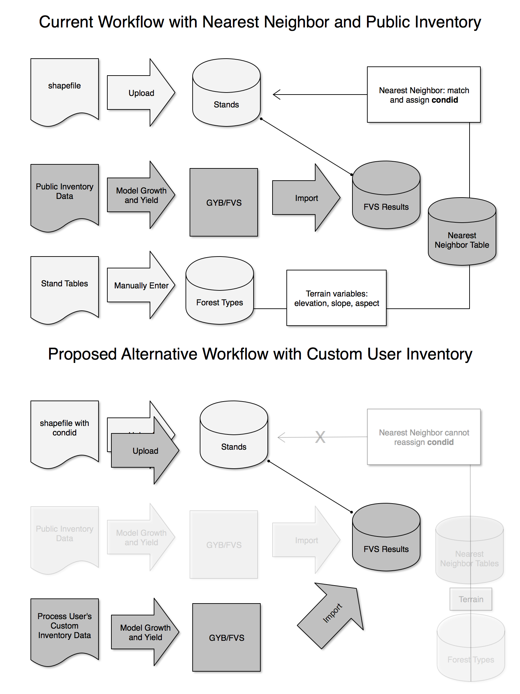

# Introduction

This document outlines the technical design details for new functionality allowing Forest Planner to accept other sources of custom inventory data. This will provide more precise and accurate reports driven by the growth and yield modeling on user's own data instead of the "nearest" public inventory data.

This increased accuracy comes at a price; forest planner site administrators must take on additional responsibility on behalf of the user. Generally this involves

* Cleaning, processing and **modeling** the growth and yield of the user's inventory data
* **Import** the growth and yield data to the forest planner database
* Creating **spatial data** with stand associated with inventory plots

This document will cover a basic example which demonstrates this complete workflow.
The intended audience for this document are site administrators or software developers
involved in building or maintaining the Forest Planner code. It is not intended
as a document for end users (unless they really care deeply about the technical details).


# Example workflow

Loading data from custom user inventory involves a number of steps that must be completed manually by the Forest Planner site administrators.

First, we will assume that the user or client in question already has a valid forest inventory and spatial data defining the stands. When the site admin receives data from the user, that data must be processed and imported into the system. Depending on the quality of the source data, this can involve different steps and effort may be highly variable depending on data quality.

The general process, as it applies to any user inventory regardless of data quality, proceeds as follows:

## Development environment set up

**TODO** :: remove branch once this has been merged with master.

For initial testing, you'll need to be on the `user_inventory` branch of the `forestplanner` repository.
```
git fetch
git checkout user_inventory
```

To confirm that the installation is running properly, fire up the virtual machine and run
```
python manage.py test trees.UserInventoryTest
```

You'll also want to install the growth-yield-batch system, either locally or on another workstation other than your dev virtual machine.

```
git clone git@github.com:Ecotrust/growth-yield-batch.git@git
```

And finally you'll need to build the FVS binaries according to [the wiki guide](https://github.com/Ecotrust/growth-yield-batch/wiki/Building-FVS-binaries-on-Linux).

## Assign Unique condition ids
First, we must ensure that each plot in the user inventory is assigned a globally unique **condition id** or `condid`. They must not conflict with public inventory condids or with any other user's condids. Unique condids are crucial to the system and determining them for each plot within a user's inventory is an important first step. Remember that condid is an integer and, if it is desired to have *identifiable* ids, it is the responsibility of the site admin to develop and implement a system for managing ids in such a manner.

As an example of such a system, we may choose to assign a numeric scale such that this user reserves a slot of condids; We might assign condid ranges starting at condid $C+(u*n)$ where:

* $C$ is a constant starting condid. For $condid>C$, all ids are assumed to belong to a user. For $condid<C$,  they are reserved for public inventory condids.
* $u$ is the forest planner user id.
* $n$ is the maximum number of allowable condids per user.

For example, our user may have 20 forest inventory plots, which they named $A1$ through $A20$. We need integer values, so we could renamed them to condid $1$ through $20$ - but that may well conflict with existing plots in the database. We need unique integers so we might assign $C=1000000$, $n=1000$.
Let's say our user id $u=19$, that would give us a starting id of $1000000 + (19 * 1000) = 1019000$. Thus our user's condids could range from $1019001$ to $1019020$.

It's important to understand that the system suggested above is not the only option; there are tradeoffs and other approaches that may be more suitable. Consider this carefully as it must be set globally and enforced through policy and practice, not software.

After deriving the unique condids, you must continue to use them in both the inventory data and spatial data throughout the process. The approach suggested in this document is to run the growth and yield modeling with native condids (e.g. 1 through 20) and then alter the growth and yield data *and* the spatial data just before import to conform to the chosen forest planner condid system.


## Create linked spatial data
Taking the user's spatial data, we'll need to clean it up to ensure that it conforms to the forest planner specifications. First, the data must be converted to an ESRI Shapefile containing Polygons, each representing a stand on the property. The data must be reprojected to the Web Mercator spatial reference system (EPSG code 3857).

In order to create the linkage between stand polygons and their condition ids, we must add or populate a `condid` column in the shapefile. These must be the unique integer condids determined in the previous step.

Once the data is complete, the component files of the shapefile are zipped into a single .zip archive.


## Process inventory data

Processing inventory data for use with the [growth-yield-batch](https://github.com/Ecotrust/growth-yield-batch) system will require variable levels of technical effort depending on the quality of the user's data.

Each condition must be represented by five files:

* `.fvs` file with treelists; must conform to the FVS sample design and file format used by the keyfiles. For example, see the specification in [input_formats.txt](https://github.com/Ecotrust/growth-yield-batch/blob/master/projects/ForestPlanner/rx/include/inputs_formats.txt)
* `.rx` file defining which variants and projections to run; usually single line `PN,*` or similar
* `.site` file defining variant and site class; e.g. `PN,2`. Make sure site classes are well defined in your config.json (see next section) and that they are semantically consistent across the whole forest planner database.
* `.std` file, one line STDINFO from FVS; see FVS manual and [example](https://github.com/Ecotrust/growth-yield-batch/blob/master/projects/ForestPlanner/cond/113.std)
* `.cli` file, technically not needed - if included, just leave blank.

Depending on the format and organization of the user's inventory data, manipulating data to match the GYB design will be a critical step in ensuring the accuracy of the resulting data. There is no automated method to do this at the moment; it will inevitably require human decision making, though after some practice and standardization I believe the process could be streamlined.

## Run growth-yield-batch model

The prescriptions (rxs) used in the growth and yield modeling of the user's stands must match almost exactly the rxs currently in the forest planner. Small changes to FVS keyfiles are OK as long as the intent of the prescription is unaltered.

The configuration of the batch lives in `config.json`. You probably won't have to edit [the default configuration](https://github.com/Ecotrust/growth-yield-batch/blob/master/projects/ForestPlanner/config.json) unless you want to add a different site class or redefine a site class for a particular property. The public inventory data in the forest planner is represented with the following site classes:


 Variant | Site Class
-----+------
 PN  |    2
 CA  |    4
 SO  |    4
 BM  |    4
 WC  |    2
 EC  |    4


It's important to note that the forest planner assumes only **one site class** per condition per variant. From a database constraint perspective, you're allowed to import the same plot data run under multiple site classes but it is to be avoided and will yield inaccurate scenario results.

With the configuration set, we can run the GYB batch:

    cd growth-yield-batch/projects/userinventory_test
    export PATH=/Users/mperry/projects/forestplanner/growth-yield-batch/scripts:$PATH

    build_keys.py
    batch_fvs.py --cores 4

As the batch is running, cd to the same directory and run `status_fvs.sh` to check the progress. Open the resulting data.db and run some queries to ensure data quality control.

## Reminder: ensure unique condids

If you're run the growth and yield modeling with native, user-defined plot ids, you'll need to convert them to forest planner condids before importing. This applies to both the growth and yield data *and* the spatial data.

To update the condids in the GYB output, you can make a copy of the database and alter the column with sqlite SQL query:

    UPDATE trees_fvsaggregate SET cond = cond + 1019000

The spatial data must be updated in a similar manner, resulting in a `condid` column with the same id scheme.

## Import into Forest Planner database
Import the growth and yield results into the forest planner database using the `import_gyb` command.

```
python manage.py import_gyb gyb_data/final/data.db
```

When uploading new data, be aware that you may need to clear some caches - see the "FVSAggregate model" section below. You many also need to rerun database statistics in order to improve performance after particularly large imports.

## Upload Spatial data

Upload spatial data to an internal account and perform manual QA/QC using the web interface to ensure that stands and inventory have been successfully linked and that scenario calculations are accurate. Then optionally upload directly to the user's account; You can do this through the web interface (if you have web access to their account) or directly in the django shell

```
from django.contrib.auth.models import User
from trees.utils import StandImporter

user = User.objects.get(username="mperry")
s = StandImporter(user)
s.import_ogr('/tmp/stands.shp', new_property_name="Matt's Property")
```

The stands will be checked and condids will be validated on import.

## General Caveats

This section highlights some of the quirks in the forest planner data model that should be kept in mind while preparing user inventory data.

In the forest planner, **temporal offsets** are encoded as integers from 0 to 4 where an offset of 1 indicates a 5-year delay in harvest. However, the growth-yield-batch system encodes offsets as integers representing the actual number of years. While the later is more flexible and more widely applicable outside the context of the forest planner, the former is more strict and ensures that growth and yield data conform to a standard pattern of offsets.

The implications of this design decision are handled by the `import_gyb` management command but if you choose another route for loading fvs data, you must handle this by dividing the gyb offset by 5 and ensuring forestplanner offset is an integer between 0 to 4, inclusive. Failure to do so will lead to all sorts of indeterminate bugs and inaccuracies.

Related to offsets, the GYB system will not (by default) apply offsets to Grow-Only prescriptions, assumed to be `rx == 1`. The forest planner, when applying offsets to scenariostands in `trees.tasks.schedule_harvest`, will set offset to zero for any grow-only stands. So, under normal usage, this should not be an issue. If, for whatever reason, the scenariostands with rx 1 get assigned a non-zero offset and the gyb data is missing non-zero offsets for rx 1, the SQL joins will drop those stands entirely.

The forest planner data model assumes that if a property contains a locked stand, the entire property will be treated as locked. If a property is ever put into a state of mixed locked and unlocked stands, the behavior is undefined and may result in bugs. As discussed in the "User Interface" section above, the UI will dissallow this by preventing user from editing stands on locked properties - but it is not enforced at the database or API level.

As more rows are added to the fvsaggregate table, database maintenance will become important to ensure continued fast query times. In particular, table statistics should be updated with `VACUUM ANALYZE` so that the postgres query planner can do it's magic most effectively. In some cases, using `CLUSTER` may even be warranted.





# Software Design

## Data requirements

To incorporate custom user inventory, spatial data uploads are used to associate stands with specific forest plots. Uploads can be done directly by the user or by site administrators on behalf of the user.

It is required that the uploaded spatial data:

1. have a `condid` attribute field containing integer values corresponding to the `condid` of the associated inventory records.
2. have all `condid`s specified in the data already exist in the `fvsaggregate` table for the variant in which the property falls.
3. have satisfied all previous constraints on shapefile uploads (zip file, web mercator projection, Shapefile, etc).


## Shapefile import API

The shapefile import creates a new property and populates it with stands corresponding to the polygons in the shapefile. This will typically be accessed through the web interface (the "Upload GIS Data" button). This section will instead focus on the programmatic interface of interest to software developers.

 The programmatic interface includes two components:

* `trees.views.upload_stands` is a django view which accepts an HTTP request, handles the uploaded file and, assuming the data are valid, creates a `ForestProperty` and `Stands` for the user based on the uploaded file. There is also an option to populate an existing `ForestProperty` though it is not exposed through the web interface.

* `trees.utils.StandImporter` is the Python class which performs the heavy lifting of
validating the data and writing it to the database.


### upload_stands view

If any of the import requirements are not met, the `upload_stands` view will reject the data and return a HTTP response with a `400` status code.

### StandImporter

The `StandImporter` class must perform additional tasks in order to associate the spatial data with custom user inventory. Specifically,

1. Validate the presence and proper data type of the `condid` column. The presence of a `condid` column triggers the following behavior - if you don't want to use a custom inventory, remove the `condid` field from the shapefile.
2. Validate that all `condids` specified have corresponding valid records in the `trees_fvsaggregate` table.
3. For each unique condition on each property, a `Strata` (aka forest type) will be created and associated with subsequent stands. Technically this is not necessary as strata are only used for the nearest neighbor process but this will allow the forest type user interface (step 3) to show the association between stands and conditions. Since this happens per-property at runtime, we have to rely on the data in the fvsaggregate table to estimate age and tpa; unfortunately we cannot reconstruct the stand list at runtime so that will contain an "N/A".
4. If all stands are valid, insert into the appropriate tables and populate the `condid`, `locked_condid` and strata column of the Stand.
    * If any stand has a non-null `locked_condid`, it is assumed to be locked and will no longer be mutated by the NearestNeighbor service.
    * If a property contains any stands that are locked, the entire property is assumed to be locked which has implications for user interface and other parts of the system.

### Nearest Neighbor

The nearest neighbor module populates the `condid` of each stand asynchronously based on public forest inventory data, assuming that forest types and terrain information are available for a given stand. In the case of custom user inventory, we want to bypass the nearest neighbor by assigning a `condid` directly at import.

We must ensure that locked stands are never disassociated with their inventory; if for whatever reason the nearest neighbor is run on a locked stand, it will simply set the stand's `condid` equal to `locked_condid`. This effectively makes it impossible to wipe out the inventory link by accidentally running the nearest neighbor.

Notably, this allows database administrators to run the nearest neighbor on *all* stands (e.g. during a large data migration involving new public inventory) without worrying how it might affect locked stands.


## Importing Growth and Yield data


### `import_gyb` management command

Since the (GYB) system will be used to perform growth and yield modeling, forest planner contains a python function and a wrapper django management command, `import_gyb`, to facilitate loading data.

The command takes a single required argument:

* `gyb_db`: Path to the sqlite database created by `growth-yield-batch`

All imports take place in the context of a database transaction such that any error will rightfully cause the entire import to roll back to it's previous state and error out - it is an all-or-none process.

Note that importing data in this manner (or by manually appending it to the fvsaggregate table) will *not* necessarily make that inventory plot available to other user via the nearest neighbor system. Other data is required to accomplish this and it is outside of the scope of this document.


## Model and database schema changes
The `Stand` model will will require a new `locked_cond_id` integer field
which serves as a key to the `trees_fvsaggregate.cond`. The new field will be nullable, null by default and will require a schema migration.

 Just as with the `trees_stand.cond_id` field, the new `trees_stand.locked_cond_id` column is not enforced as a foreign key due to practical constraints when importing data - the site admin is responsible for maintaining the foreign key referential integrity through proper data practices. In other words, if a stand has a `locked_cond_id` or `cond_id` which points to a non-existent record in `fvsaggregate`, you're going to have problems. The import procedure will enforce this *at import* but further data migrations will need to keep this in mind.

Additionally, the `Stand` model will have an additional `is_locked` property that will return a boolean indicating the presence of a `locked_cond_id`; it is effectively a semantic convinience for checking if `locked_cond_id` is null.

Similarly, the `ForestProperty` model will also have an additional `is_locked` property if *any* stands belonging to it are locked.


## FVSAggregate model

On importing user's stands, we need to confirm that there exist valid records for the associated condition in the fvsaggregate table. To accomplish this, we add a `valid_condids` classmethod to `FVSAggregate`. As a classmethod, it can be called on the class rather than an instance, allowing for simply:

    pn = FVSVariant.objects.get(code="PN")  # get pacific northwest variant
    FVSAggregate.valid_condids(pn)

This returns a list of all "valid" condids for this variant. At this point, validity is defined loosely - it currently just returns a list of condids for that variant. More advanced logic (e.g. checking that they have all necessary rxs, offsets, etc.) may be added as required. Until then, it's up to the site administrators to ensure that any data added to the fvsaggregate table is done cleanly.

Because the query may be very computationally expensive, this method is cached. Therefore it is required to clear the cache when new data is added. This can be done using Redis directly:

    $ redis-cli
    redis 127.0.0.1:6379> select 1
    OK
    redis 127.0.0.1:6379[1]> keys *valid_condids*
    1) ":1:fvsaggregate_valid_condids_varWC"
    redis 127.0.0.1:6379[1]> DEL ":1:fvsaggregate_valid_condids_varWC"
    (integer) 1
    redis 127.0.0.1:6379[1]> keys *valid_condids*
    (empty list or set)


## User interface

In the stand editing and creation UI (Step 2), we disallow creation of new stands for locked properties. This is accomplished by hiding the editing buttons (create, edit, delete) if property is locked and will not necessarily be enforced at the HTTP or Python API level.

In the forest type UI (Step 3), we continue to show forest types which, in the case of locked properties, will be named by the condition id. Users may not edit stands or forest types (no create, edit, apply, or delete) and will be notified as such.


